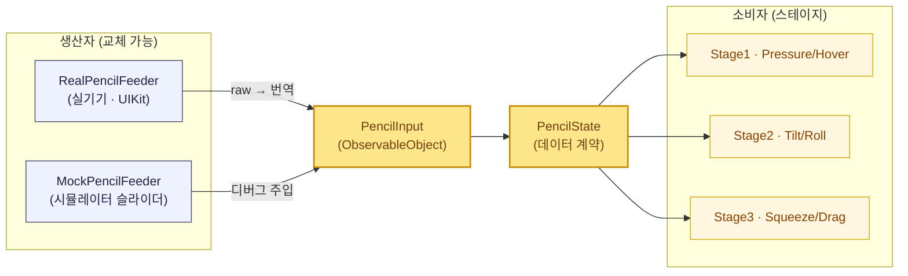
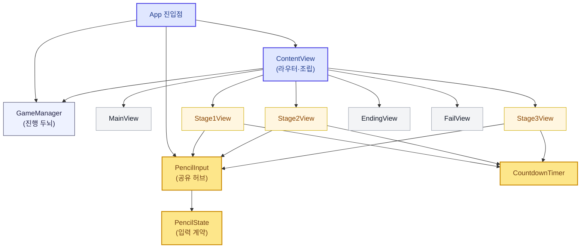
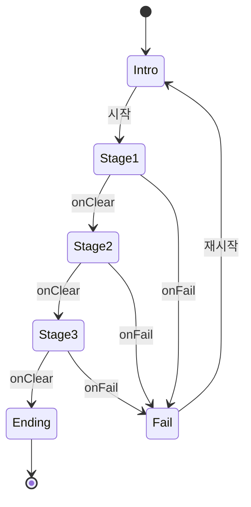
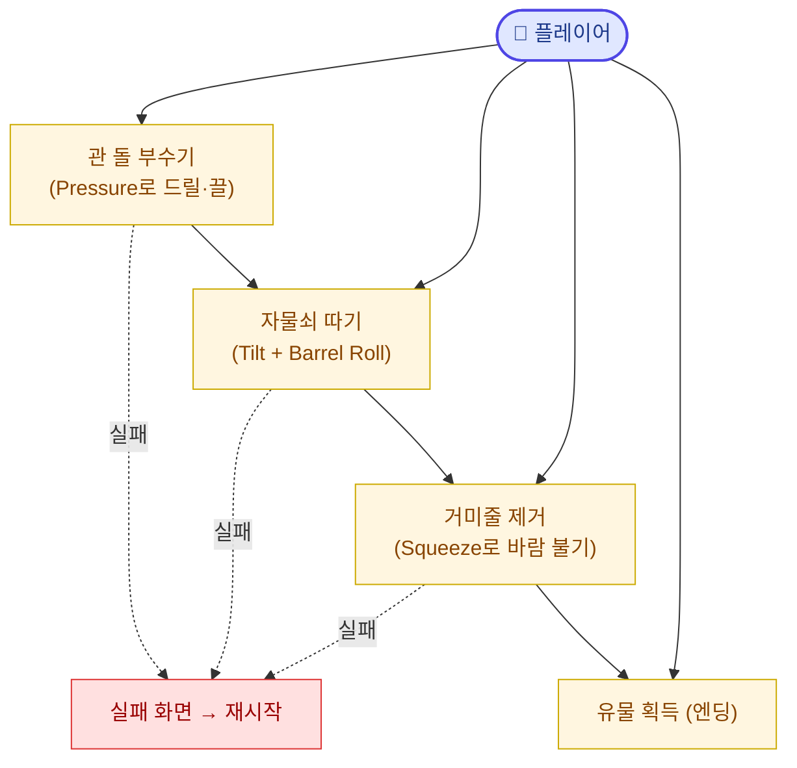
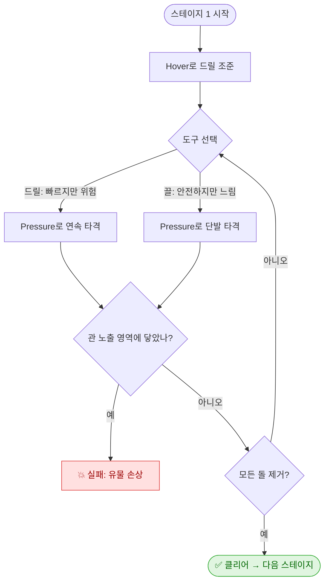

# 🏺 코리카멘 (Korikamen)

> **애플펜슬 프로의 기능을 활용한 2D 선형 방탈출형 게임**
> 이집트 투탕카멘 유물 도굴을 컨셉으로, 펜 하나가 매 스테이지마다 다른 도굴 도구로 변신합니다.

스토리 → 스테이지 1~3 → 엔딩으로 이어지는 짧고 밀도 높은 플레이. 각 스테이지는 서로 다른 Apple Pencil Pro 인터랙션을 사용해 "펜으로 진짜 도굴하는" 감각을 전달합니다.

---

## 📖 목차
- [게임 소개](#-게임-소개)
- [팀 소개](#-팀-소개)
- [기술 스택](#-기술-스택)
- [아키텍처](#-아키텍처)
- [유즈케이스](#-유즈케이스)
- [핵심 설계 규칙](#-핵심-설계-규칙)
- [폴더 구조](#-폴더-구조)
- [문서 인덱스](#-문서-인덱스)

---

## 🎮 게임 소개

투탕카멘의 무덤을 터는 도굴꾼이 되어 제한 시간 안에 세 개의 관문을 통과하고 유물 **코리카멘**을 손에 넣습니다. 펜 하나가 스테이지마다 드릴 → 락픽 → 바람 도구로 바뀌는 것이 핵심 재미입니다.

| 스테이지 | 컨셉 | 펜 동작 | 사용한 애플펜슬 기능 |
| --- | --- | --- | --- |
| **1. 관 돌 부수기** | 돌무더기를 부숴 관 노출 (드릴/끌) | 꾹 누르기 · 가까이 대기 | `Pressure` · `Hover` |
| **2. 관 자물쇠 따기** | 락픽으로 자물쇠 해제 | 눕히기 · 비틀기 | `Tilt` · **`Barrel Roll`** ⭐ |
| **3. 거미줄 제거** | 바람을 불어 거미줄 걷어내기 | 끌기 · 펜대 쥐기 | `Drag` · **`Squeeze`** ⭐ |

> ⭐ **Barrel Roll**(펜 회전)과 **Squeeze**(펜대 쥐기)는 Apple Pencil **Pro**에서 새로 추가된 기능입니다.

---

## 👥 팀 소개

| 이름 | 역할 | 담당 |
| --- | --- | --- |
| **노튼** | Developer | 스테이지 3 (거미줄 제거 · Squeeze/Drag) |
| **맥스** | Developer | 스테이지 1 (돌 부수기 · Pressure/Hover) |
| **실라** | Developer | 스테이지 2 (자물쇠 따기 · Tilt/Barrel Roll) |
| **코리** | Designer | UI 디자인 (공통 뷰·HUD·화면 흐름) |
| **캇** | Designer | 3D 에셋 디자인 (관·유물 모델링, 비주얼) |

> 각 개발자는 `Stages/StageN_*` 폴더의 오너십을 가지며, 공통 토대(`Core`/`PencilInput`)는 합의 후 함께 관리합니다.

---

## 🛠 기술 스택

| 프레임워크 | 용도 |
| --- | --- |
| **SwiftUI** | 전체 UI, 상태 바인딩 |
| **GameplayKit** | 스테이지 전환 (`GKStateMachine` / `GKState`) |
| **UIKit** | 애플펜슬 raw 입력 (`UIPencilInteraction` 스퀴즈 등) |
| **SpriteKit** | 거미줄/돌 레이어 연출 (SwiftUI에 `SpriteView`로 임베드) |
| **Combine** | 타이머·게이지 스트림 (`Timer.publish`) |

---

## 🏛 아키텍처

### 2층 구조 (Core + Stages)

선형 게임이지만 세 스테이지가 **타이머·HUD·연출·전환·펜슬 입력을 공유**하므로, 완전 격리 대신 2층으로 설계했습니다.

- **Core (공통 토대)** — 모든 스테이지가 의존. 먼저 계약을 합의/구현하고 오너십을 둠.
- **Stages (피처)** — 한 명이 한 스테이지를 Core 위에 얹어 **병렬 개발**.

### 펜슬 입력 — Port / Adapter

"입력받는 로직"과 "받아서 쓰는 로직"을 분리해, 스테이지 개발자는 raw 펜슬 API를 몰라도 되고 **시뮬레이터에서 Mock으로 개발**할 수 있습니다.



### 모듈 의존 구조 (팬인 · 팬아웃)

화살표는 **"A가 B를 의존/사용한다"** 방향.



- 🟨 **팬인 허브 = `PencilInput`** : 스테이지 전체가 수렴하는 공유 의존. 변경 시 팀 합의 필요.
- 🟪 **팬아웃 허브 = `ContentView`** : 모든 화면을 조립하는 유일한 지점. 얇게(배선만) 유지.
- ✅ 스테이지끼리, 스테이지 → `GameManager` 직접 의존이 **없음** (`onClear`/`onFail` 클로저로만 연결) → 병렬 개발에 이상적.

### 스테이지 전환 (GameManager + GKStateMachine)

`GKStateMachine`이 **진실의 원천**, `phase`는 SwiftUI 표시용 복사본. 각 스테이지 뷰는 클리어 시 `onClear()`만 호출하면 됩니다.



---

## 🎯 유즈케이스

플레이어가 펜 하나로 세 관문을 통과하는 흐름.



### 스테이지 1 플레이 흐름 예시



---

## 📐 핵심 설계 규칙

1. **게임 로직은 `PencilState` 계약에만 의존** — raw 펜슬 API(`altitudeAngle`, `rollAngle`, `UIPencilInteraction` 등)를 스테이지 코드에서 직접 호출 금지.
2. **스테이지별 판정 로직을 억지로 공통화하지 말 것** (Rule of Three) — 겉모습(View)만 공통, 알맹이는 각자.
3. **폴더 경계 준수** — 각자 `Stages/StageN_*`만 수정 → 머지 충돌 방지.
4. **워킹 스켈레톤 우선** — 끝까지 도는 빈 껍데기부터. 빅뱅 통합 금지.
5. **커밋 메시지**는 `docs/conventions.md` 규칙을 따른다.

### 공통화 기준 ⚠️

| ✅ 공통화 (Core/CommonUI) | ❌ 공통화 금지 (스테이지별) |
| --- | --- |
| 타이머, HUD, 성공/실패 연출, 사운드 | 각 스테이지의 **판정 로직** |
| 게이지의 *겉모습* (`GaugeView(value:)`) | 게이지를 *채우는 규칙* |
| 펜슬 입력 계약, 스테이지 전환 | 스테이지별 에셋/씬 레이아웃 |

---

## 📁 폴더 구조

```
C3_Korikamen/
├── App/                  # @main 진입점, RootView (phase 따라 화면 분기)
├── Core/                 # GameManager, GKStateMachine, 스테이지 공통 계약
├── PencilInput/          # 애플펜슬 입력 (Port/Adapter)
│   ├── PencilState.swift     # 데이터 계약
│   ├── PencilInput.swift     # 관찰 대상
│   ├── RealPencilFeeder.swift # 실기기 어댑터
│   └── MockPencilFeeder.swift # 시뮬레이터 스텁
├── CommonUI/             # TimerHUDView, GaugeView, 결과 연출
├── Common/               # CountdownTimer, 사운드/햅틱
├── Stages/
│   ├── Stage1_Rock/      # 맥스
│   ├── Stage2_Lock/      # 실라
│   └── Stage3_Spider/    # 노튼
├── Story/                # 인트로/엔딩 컷
└── Resources/            # 에셋 (Stage1/2/3 하위 폴더)
```

---

## 📚 문서 인덱스

- [`docs/architecture.md`](docs/architecture.md) — 폴더 구조, 2층 설계, 공통 vs 스테이지별
- [`docs/team-workflow.md`](docs/team-workflow.md) — 업무 분장, 계약우선·스텁, 워킹스켈레톤
- [`docs/contracts/pencil-input.md`](docs/contracts/pencil-input.md) — 애플펜슬 입력 계약 (Port/Adapter)
- [`docs/conventions.md`](docs/conventions.md) — 커밋/네이밍/폴더 컨벤션
- [`docs/design/`](docs/design/) — 스테이지별 기능 기획서

---

> 🏺 *"펜 하나로 무덤을 털어라."* — Team Korikamen
