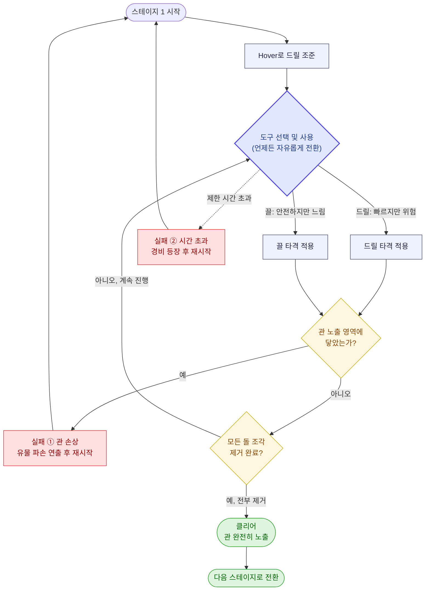

```mermaid
flowchart TD
    Start([스테이지 1 시작]) --> Hover[Hover로 드릴 조준]
    
    Hover --> ToolSelect{"도구 선택 및 사용<br/>(언제든 자유롭게 전환)"}

    ToolSelect -->|드릴: 빠르지만 위험| Drill[드릴 타격 적용]
    ToolSelect -->|끌: 안전하지만 느림| Chisel[끌 타격 적용]

    %% 공통 판정 구간으로 병합 (중복 제거)
    Drill --> DangerCheck
    Chisel --> DangerCheck

    DangerCheck{관 노출 영역에<br/>닿았는가?}
    DangerCheck -->|예| Fail1[실패 ① 관 손상<br/>유물 파손 연출 후 재시작]
    DangerCheck -->|아니오| ClearCheck{모든 돌 조각<br/>제거 완료?}

    ClearCheck -->|아니오, 계속 진행| ToolSelect
    ClearCheck -->|예, 전부 제거| Clear([클리어<br/>관 완전히 노출])
    Clear --> Next([다음 스테이지로 전환])

    %% 제한 시간
    ToolSelect -. 제한 시간 초과 .-> Fail2[실패 ② 시간 초과<br/>경비 등장 후 재시작]

    Fail1 --> Start
    Fail2 --> Start

    %% 스타일
    classDef fail fill:#ffe0e0,stroke:#d33,color:#900
    classDef clear fill:#e0f5e0,stroke:#3a3,color:#060
    classDef action fill:#eef2ff,stroke:#446,color:#224
    classDef decision fill:#fff6e0,stroke:#ca0,color:#840
    classDef selectNode fill:#e0e7ff,stroke:#4f46e5,color:#1e3a8a,stroke-width:2px

    class Fail1,Fail2 fail
    class Clear,Next clear
    class Drill,Chisel,Hover action
    class DangerCheck,ClearCheck decision
    class ToolSelect selectNode
```
