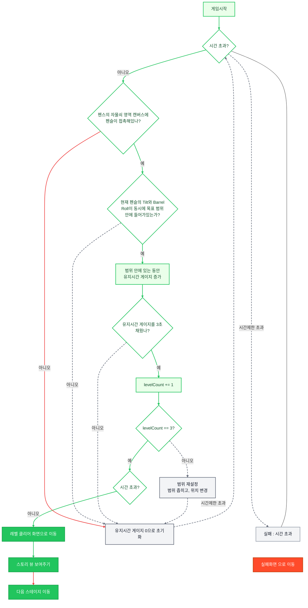
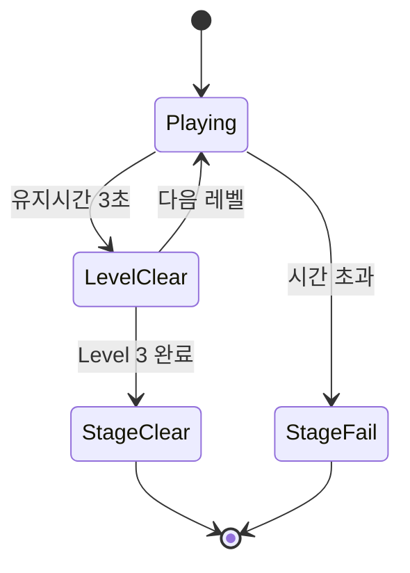

# 스테이지 2 : 관 자물쇠 따기

> **기능 기획서** · 이집트 투탕카멘 유물 도굴 게임

Apple Pencil Pro를 락픽(Lockpick)처럼 사용하여 관의 자물쇠를 해제하는 스테이지. 플레이어는 Pencil의 Tilt(기울기)와 Barrel Roll(회전)을 동시에 조절하여 특정 범위를 맞춘 상태를 유지해야 한다. 레벨이 올라갈수록 허용 범위가 좁아지며 정밀한 조작이 요구된다.

---

## 🍎 완료 판단 기준

* [ ] Tilt와 Barrel Roll을 어떻게 판정하는지 알 수 있다
* [ ] 플레이어가 어떤 조건을 만족해야 자물쇠가 열리는지 알 수 있다
* [ ] 레벨이 올라갈수록 어떤 방식으로 난이도가 상승하는지 알 수 있다
* [ ] 유지 시간 게이지가 어떤 역할을 하는지 알 수 있다
* [ ] 성공/실패 조건을 플레이어가 직관적으로 이해할 수 있다

---

## 1. Apple Pencil 입력 확정

플레이어는 Apple Pencil Pro를 실제 락픽처럼 조작하여 자물쇠를 해제한다.

| 구분        | Tilt       | Barrel Roll |
| --------- | ---------- | ----------- |
| **의미**    | 펜의 기울기     | 펜의 회전       |
| **범위**    | 0° ~ 60°   | 0° ~ 360°   |
| **조작 방식** | 펜을 눕히거나 세움 | 펜 자체를 비틈    |
| **판정 사용** | 목표 범위 비교   | 목표 범위 비교    |

### Tilt 계산

```
Tilt = 90 - altitudeAngle
```

* 펜이 수직에 가까울수록 Tilt = 0°
* 펜이 눕혀질수록 Tilt 증가
* Altitude 30° 이하 영역은 사용하지 않음

---

## 2. 잠금 해제 시스템

각 레벨은 목표 Tilt 범위와 목표 Barrel Roll 범위를 가진다.

플레이어는 두 조건을 동시에 만족해야 한다.

| 조건         | 설명               |
| ---------- | ---------------- |
| Tilt 범위 만족 | 현재 Tilt가 목표 범위 안 |
| Roll 범위 만족 | 현재 Roll이 목표 범위 안 |
| 유지 시간      | 위 상태를 3초 연속 유지   |

### 유지 시간 규칙

| 상태      | 결과               |
| ------- | ---------------- |
| 목표 범위 안 | 유지 시간 증가         |
| 목표 범위 밖 | 유지 시간 즉시 0으로 초기화 |

유지 시간이 3초에 도달하면 현재 레벨 클리어.

---

## 3. 레벨 시스템

총 3개의 잠금을 순차적으로 해제해야 한다.

| 레벨      | Tilt 범위 폭 | Roll 범위 폭 |
| ------- | --------- | --------- |
| Level 1 | 15°       | 50°       |
| Level 2 | 10°       | 35°       |
| Level 3 | 5°        | 25°       |

### 목표 범위 생성

* 각 레벨 시작 시 목표 범위 생성
* Tilt 범위는 유효 영역 내에서 선택
* Roll 범위는 0°~360° 전체 영역 사용
* 일정 부족 시 고정값 사용 가능
* 추후 랜덤 생성으로 확장 예정

### 레벨 전환

* 유지 시간 3초 달성
* 자물쇠 해제 효과 출력
* 다음 레벨 목표 범위 생성
* 난이도 상승

---

## 4. 플레이 흐름

1. 스테이지 시작
2. 제한 시간 카운트 시작
3. 레벨 1 목표 범위 생성
4. Pencil 기울기와 회전을 조절
5. 목표 범위 유지
6. 유지 시간 3초 달성
7. 자물쇠 해제 연출
8. 레벨 2 진행
9. 레벨 3 진행
10. 모든 잠금 해제 시 클리어

### 플로우 차트



---

## 5. UI 구성

### 상단 HUD

| 위치  | 내용            |
| --- | ------------- |
| 좌상단 | 현재 레벨 / 목표 정보 |
| 우상단 | 남은 시간         |

### 좌측 계기판

* 현재 Tilt 값
* 현재 Barrel Roll 값
* 유지 시간 게이지
* 현재 레벨 표시

### 우측 자물쇠 영역

* 관 자물쇠 이미지
* Pencil 인터랙션 영역
* 레벨별 잠금 해제 연출 표시

---

## 6. 피드백

### 조건 만족 중

* 유지 시간 게이지 증가
* 자물쇠 진동 또는 미세한 움직임
* 범위 진입 효과음

### 레벨 클리어

* 잠금 해제 애니메이션
* 금속 해제 효과음
* 다음 잠금 표시

### 스테이지 클리어

* 관 개방 연출
* 성공 효과음
* 다음 스테이지 이동

### 실패

* 시간 종료
* 자물쇠 원상 복귀
* 실패 효과음

---

## 7. 성공 / 실패 조건

### 성공

* 제한 시간 내 Level 1 ~ Level 3 전부 해제

### 실패

* 제한 시간 종료

---

## 8. 상태 흐름



---

