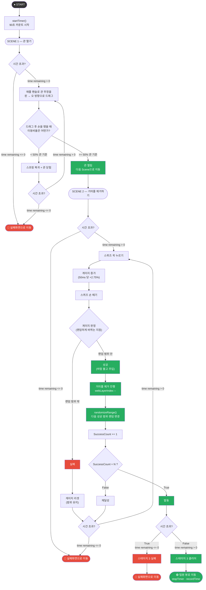

```mermaid
flowchart TD
    START([● START]) --> startTimer["startTimer()\n90초 카운트 시작"]

    %% ─────────────────────────────
    %% SCENE 1 — 관 열기
    %% ─────────────────────────────
    startTimer --> S1(["SCENE 1 — 관 열기"])
    S1 --> TC1{"시간 초과?"}

    TC1 -->|"time remaining <= 0"| FAIL_S1(["🔴 실패화면으로 이동"])
    TC1 -->|"time remaining > 0"| DRAG["애플 펜슬로 관 뚜껑을\n왼 → 오 방향으로 드래그"]

    DRAG --> RATIO{"드래그 후 손을 뗐을 때\n이동비율은 어떤가?"}

    RATIO -->|"< 50%  관 기준"| SNAP["스프링 복귀 + 관 닫힘"]
    RATIO -->|">= 50%  관 기준"| OPEN["관 열림\n다음 Scene으로 이동"]

    SNAP --> TC1_RETRY{"시간 초과?"}
    TC1_RETRY -->|"time remaining <= 0"| FAIL_S1
    TC1_RETRY -->|"time remaining > 0"| DRAG

    %% ─────────────────────────────
    %% SCENE 2 — 거미줄 제거
    %% ─────────────────────────────
    OPEN --> S2(["SCENE 2 — 거미줄 제거하기"])
    S2 --> TC2_ENTRY{"시간 초과?"}

    TC2_ENTRY -->|"time remaining <= 0"| FAIL_S2(["🔴 실패화면으로 이동"])
    TC2_ENTRY -->|"time remaining > 0"| SQUEEZE["스퀴즈 꾹 누르기"]

    SQUEEZE --> GAUGE["게이지 증가\n(50ms 당 +2.75%)"]
    GAUGE --> RELEASE["스퀴즈 손 떼기"]
    RELEASE --> JUDGE{"게이지 판정\n(랜덤하게 바뀌는 지점)"}

    %% 판정 분기
    JUDGE -->|"랜덤 범위 안"| SUCCESS["성공\n(바람 불고 주입)"]
    JUDGE -->|"랜덤 범위 밖"| FAIL_GAUGE["실패"]

    %% 성공 경로
    SUCCESS --> WEB["거미줄 제거 진행\nwebLayerIndex --"]
    WEB --> RANDOM["randomizeRange()\n다음 성공 범위 랜덤 변경"]
    RANDOM --> INC["SuccessCount += 1"]
    INC --> CHECK{"SuccessCount = N ?"}

    %% 실패 경로
    FAIL_GAUGE --> RESET["게이지 리셋\n(범위 유지)"]

    %% 재시도 루프
    RESET --> TC2_RETRY{"시간 초과?"}
    CHECK -->|"False"| RETRY["재달성"]
    RETRY --> TC2_RETRY

    TC2_RETRY -->|"time remaining <= 0"| FAIL_S2
    TC2_RETRY -->|"time remaining > 0"| SQUEEZE

    %% 최종 클리어 판정
    CHECK -->|"True"| FIRE["발동"]
    FIRE --> TC3{"시간 초과?"}

    TC3 -->|"True\ntime remaining <= 0"| STAGE_FAIL["스테이지 3 실패"]
    TC3 -->|"False\ntime remaining > 0"| STAGE_CLEAR["스테이지 3 클리어"]

    STAGE_FAIL  --> FAIL_FINAL(["🔴 실패화면으로 이동"])
    STAGE_CLEAR --> NEXT(["🟢 팀원 뷰로 이동\nstopTimer · recordTime"])

    %% ─────────────────────────────
    %% 스타일
    %% ─────────────────────────────
    style START         fill:#333,color:#fff
    style FAIL_S1       fill:#e74c3c,color:#fff
    style FAIL_S2       fill:#e74c3c,color:#fff
    style FAIL_FINAL    fill:#e74c3c,color:#fff
    style FAIL_GAUGE    fill:#e74c3c,color:#fff
    style STAGE_FAIL    fill:#e74c3c,color:#fff
    style SUCCESS       fill:#27ae60,color:#fff
    style WEB           fill:#27ae60,color:#fff
    style RANDOM        fill:#27ae60,color:#fff
    style OPEN          fill:#27ae60,color:#fff
    style FIRE          fill:#27ae60,color:#fff
    style STAGE_CLEAR   fill:#27ae60,color:#fff
    style NEXT          fill:#27ae60,color:#fff  
```
