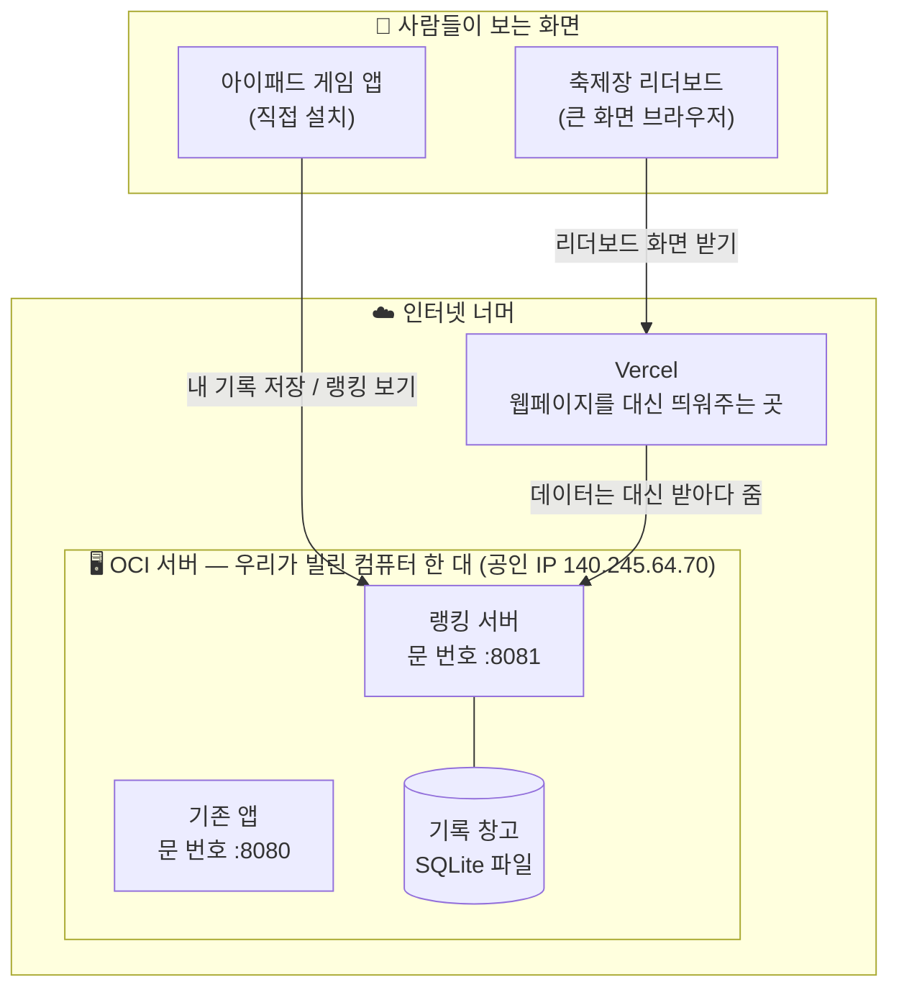
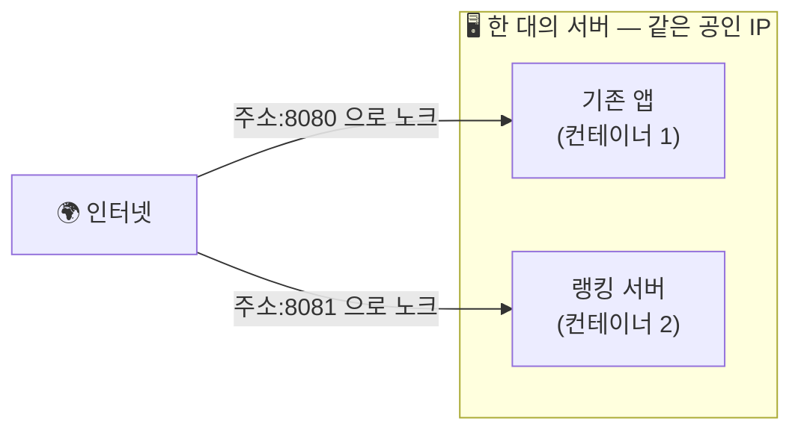
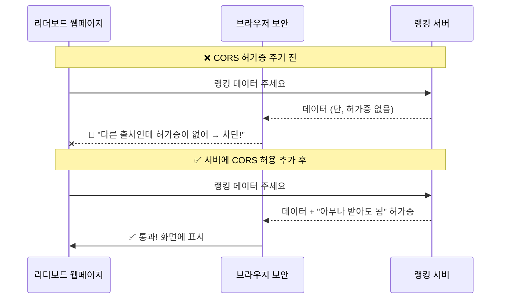
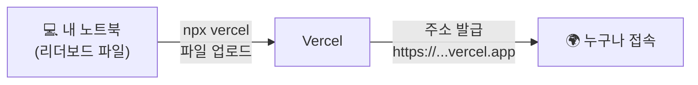
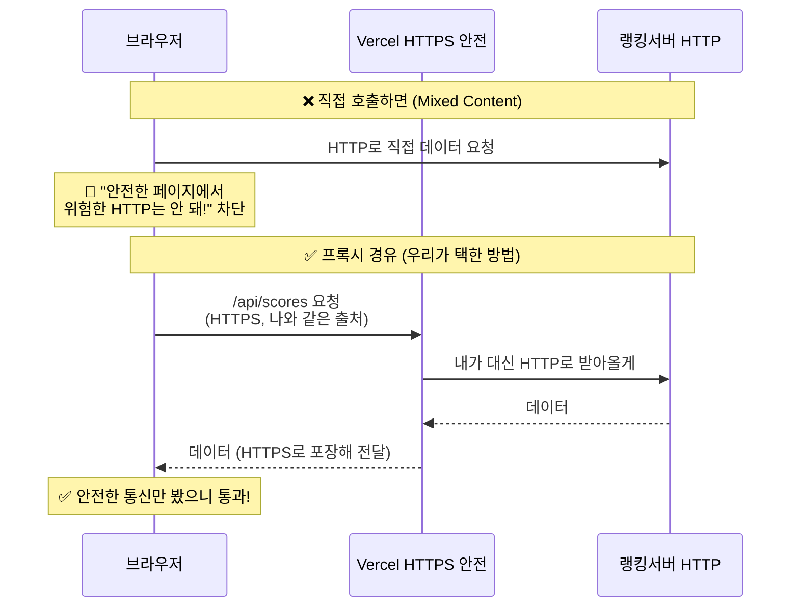
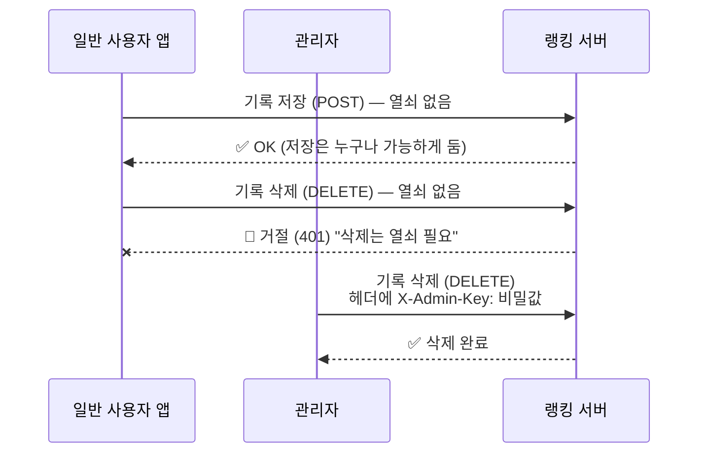
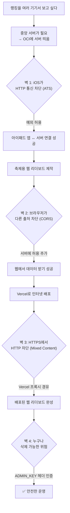

# 코리카멘 네트워크·인프라 회고 — 비개발 직군을 위한 쉬운 설명

> 이 문서는 Swift 문법이나 HTML 태그 같은 "코드"를 설명하지 않습니다.
> 대신 **랭킹 기능을 만들면서 서버·인터넷·배포 단에서 실제로 부딪힌 문제들**과,
> 그걸 어떻게 풀었는지를 **비유와 그림(Mermaid 다이어그램)** 으로 풀어 씁니다.
> 디자이너·기획자 등 비개발 직군이 "아, 그래서 그런 작업이 필요했구나"를 이해하는 게 목표입니다.

---

## 0. 등장인물 — 우리가 만든 시스템의 큰 그림

랭킹 하나 보여주는데 왜 이렇게 많은 게 필요했을까요? 먼저 전체 지도를 봅시다.

**핵심 한 줄**: 여러 기기(아이패드 여러 대, 축제장 큰 화면)가 **같은 기록을 함께 보려면**, 기록을 한 곳에 모아두는 **중앙 컴퓨터(서버)** 가 필요합니다. 그 서버를 OCI(오라클 클라우드)에 빌려서 띄웠고, 축제용 리더보드 웹페이지는 Vercel에 올렸습니다.

---

## 1. 왜 "서버"가 필요했나 — 공책 하나를 여럿이 나눠 쓰기

처음엔 이런 의문이 자연스럽습니다. "그냥 게임 안에 기록을 저장하면 안 되나?"

- 게임 안(아이패드 한 대)에만 저장하면 → **그 아이패드에서만** 기록이 보입니다. 옆 사람 아이패드, 축제장 큰 화면은 그 기록을 모릅니다.
- 여러 기기가 **같은 순위표**를 보려면, 기록을 **모두가 접근하는 한 곳**에 적어야 합니다.

> 🧩 **비유**: 동아리 회비 장부를 각자 수첩에 적으면 서로 안 맞습니다. **벽에 공용 화이트보드** 하나 걸고 거기 적으면 모두가 같은 내용을 봅니다. 그 화이트보드가 **서버**입니다.

그래서 우리는 인터넷 어딘가에 항상 켜져 있는 컴퓨터(서버)를 하나 두고, 거기에:
- **기록을 적고**(저장),
- **기록을 빠른 순으로 읽는**(조회)

기능을 만들었습니다. 이 "적고 읽는 창구"를 **API**라고 부릅니다.

---

## 2. 서버를 인터넷에 올리기 — 주소, 문 번호, 경비실

서버 컴퓨터를 빌렸으면, 다른 기기가 거기로 **찾아올 수 있어야** 합니다. 여기서 세 가지 개념이 나옵니다.

### 2-1. 공인 IP = "도로명 주소"

`140.245.64.70` 같은 숫자가 우리 서버의 **인터넷 주소**입니다. 전 세계 어디서든 이 주소로 우리 서버를 찾아올 수 있습니다.

> 🧩 **비유**: 공인 IP는 **전국 어디서나 택배가 찾아오는 도로명 주소**입니다.

### 2-2. 포트(Port) = "건물 안의 문 번호 / 창구 번호"

한 서버(건물 하나)에는 여러 프로그램이 동시에 살 수 있습니다. 그걸 구분하는 게 **포트 번호**입니다.

이번에 중요한 일이 있었죠 — **그 서버엔 이미 다른 앱(Spring Boot)이 `8080`번 문을 쓰고 있었습니다.** 그래서 우리 랭킹 서버는 **`8081`번 문**을 새로 열었습니다.

> 🧩 **비유**: 같은 건물(서버)에 **여러 사무실**이 있고, 각 사무실은 **문 번호**가 다릅니다. `140.245.64.70:8080`은 1호 사무실, `:8081`은 2호 사무실. 한 건물에 사무실 여러 개 두는 건 전혀 문제가 아닙니다(이게 Docker 컨테이너로 깔끔히 분리됩니다). **규칙은 하나 — 문 번호만 겹치지 않으면 됩니다.**

### 2-3. 방화벽 = "2겹의 경비실"

주소와 문이 있어도, **경비실이 문을 막고 있으면** 못 들어갑니다. OCI 서버는 경비실이 **2겹**이라, 초보자가 가장 많이 막히는 지점입니다.

1. **클라우드 경비실**(OCI 보안 목록) — "이 문(8081)으로 외부인 출입 허용" 등록
2. **건물 자체 경비실**(서버 OS 방화벽) — 여기도 같은 문을 열어줘야 함

둘 다 열어야 비로소 외부에서 들어옵니다.

### 2-4. 곁가지: "서브넷은 터널링인가요?" — 아니요

작업 중 "서브넷이 내 IP를 나눠 쓰는 거니까 터널링이냐?"는 질문이 있었는데, **전혀 다른 개념**입니다.

- **사설 IP**(`10.0.0.x`) = 건물 **내부에서만 통하는 호수 번호**. 택배기사(인터넷)는 이걸로 못 찾아옵니다.
- **공인 IP**(`140.245.64.70`) = 앞서 말한 **전국구 도로명 주소**.
- **서브넷**을 나누는 건 그냥 **건물 내부 구획**일 뿐, 외부 노출과 무관합니다.

OCI는 진짜 공인 IP를 직접 주기 때문에, 외부에서 바로 접속됩니다(별도 우회 장치 불필요).

---

## 3. 첫 번째 벽 — iOS는 "안전하지 않은 통신"을 막는다 (ATS)

서버가 떴고 아이패드 앱에서 연결을 시도했더니… 막혔습니다. 원인은 **ATS(App Transport Security)** 라는 iOS의 보안 규칙입니다.

### 무슨 일?

인터넷 통신엔 두 종류가 있습니다.

| | HTTP | HTTPS |
| --- | --- | --- |
| 뜻 | 평문(그냥 글) | 암호화(자물쇠) |
| 비유 | **엽서** (누구나 내용 봄) | **봉인된 등기우편** |

우리 서버는 빠르게 만드느라 **HTTP(엽서)** 로 통신했는데, **iOS는 기본적으로 앱이 HTTP로 통신하는 걸 차단**합니다. "안전하지 않으니 막겠다"는 거죠.

### 어떻게 풀었나

두 가지 길이 있었습니다.

1. **예외 등록** — 앱 설정(`Info.plist`)에 "이 앱은 평문 통신을 허용한다"고 명시. (지금 택한 방법, 내부 테스트라 가능)
2. **제대로 된 길** — 서버에 **자물쇠(HTTPS)** 를 채우기. 이건 도메인과 인증서가 필요해서 나중 과제로.

> 🧩 **비유**: 회사(iOS)가 "기밀 문서는 엽서로 못 보낸다"는 규칙이 있는데, 급해서 "이 한 건만 예외로 엽서 허용" 도장을 받은 셈입니다.

---

## 4. 두 번째 벽 — 웹 리더보드와 CORS (다른 출처 차단)

축제용 리더보드는 **웹페이지(브라우저)** 로 만들었습니다. 그런데 브라우저에서 서버 데이터를 받아오려 하자 또 막혔습니다. 이번 범인은 **CORS** 입니다.

### 먼저, 브라우저의 기본 보안 — "같은 출처만 믿어"

브라우저에는 **"같은 출처 정책(Same-Origin Policy)"** 이라는 기본 보안이 있습니다.

- **출처(Origin)** = 주소 + 포트의 조합. 예: `vercel.app`과 `140.245.64.70:8081`은 **서로 다른 출처**입니다.
- 브라우저는 보안상, **웹페이지가 자기와 다른 출처의 데이터를 함부로 받아오는 걸 기본 차단**합니다.

> 🧩 **비유**: 회사 보안팀(브라우저)이 "우리 직원(웹페이지)이 **다른 회사**(서버)에 가서 자료를 받아오면, 그 다른 회사가 **'우리 자료 가져가도 좋다'는 허가증**을 줬을 때만 통과시킨다"는 규칙입니다. 허가증이 없으면 직원이 자료를 들고 와도 **정문에서 압수**합니다.

### 무슨 일? (CORS 차단)

우리 서버는 그 **허가증(CORS 헤더)** 을 안 주고 있었습니다. 그래서 데이터는 도착했는데 브라우저가 "허가증 없네?" 하고 막은 겁니다.

> 헷갈리기 쉬운 점: **Postman이나 curl로는 잘 됐어요.** 그건 **브라우저가 아니라서** 이 보안 규칙이 없기 때문입니다. CORS는 **브라우저에만** 있는 규칙입니다.

### 어떻게 풀었나

**서버 쪽에 "모든 출처 허용"이라는 허가증을 발급하도록** 설정을 한 줄 추가했습니다. (랭킹은 누구나 봐도 되는 공개 정보라 전체 허용해도 안전)

이후 브라우저가 데이터를 받아 화면에 그릴 수 있게 됐습니다.

---

## 5. 세 번째 벽 — Vercel 배포와 Mixed Content (안전/위험 혼합)

리더보드를 **"노트북 없이도 아무나 보게"** 하려고 인터넷에 올리기로 했습니다. 그 도구가 **Vercel** 입니다.

### Vercel이 뭔가요? — "임대 전시장"

Vercel은 **내 웹페이지 파일을 받아서, 인터넷에 대신 띄워주고 주소(URL)를 주는 서비스**입니다.

- 명령 한 줄(`npx vercel`)로 **로컬 폴더의 파일이 Vercel로 올라가고**, Vercel이 그걸 전 세계에 빠르게 서빙합니다.
- 그러면 **내 노트북을 꺼도** 리더보드가 계속 떠 있습니다(Vercel이 대신 띄워주니까).

> 🧩 **비유**: 내가 만든 포스터(웹페이지)를 **유명한 전시장(Vercel)** 에 맡기면, 전시장이 좋은 자리에 걸어주고 "여기로 오세요" 주소를 줍니다. 내 집(노트북)은 닫아도 포스터는 전시장에 계속 걸려 있습니다.

> ❓ "한 번 올리면 내 손을 떠나나요?" → **아니요.** 그 전시장은 **내 계정**으로 빌린 것이라, 언제든 대시보드에서 **내리거나(Delete)** 고칠 수 있습니다. 원본 파일도 내 노트북에 그대로 남습니다.

### 무슨 일? (Mixed Content)

그런데 Vercel에 올리자 데이터가 또 안 나왔습니다. 이번 범인은 **Mixed Content(혼합 콘텐츠)** 입니다.

- Vercel이 준 주소는 **HTTPS(자물쇠, 안전)** 입니다.
- 그런데 우리 랭킹 서버는 **HTTP(엽서, 안전하지 않음)** 였죠.
- 브라우저는 **"안전한(HTTPS) 페이지가 안전하지 않은(HTTP) 데이터를 가져오는 것"** 을 막습니다.

> 🧩 **비유**: 보안 등급이 높은 건물(HTTPS 페이지) 안에서, **검증 안 된 택배(HTTP)** 를 받으려 하면 경비가 막습니다. "안전한 곳에 위험한 걸 섞지 마!"

신기한 건, 로컬(`localhost`)에서 테스트할 땐 됐다는 거예요. 그땐 페이지도 HTTP, 서버도 HTTP라 **둘 다 위험 등급이 같아서** 안 막혔습니다. Vercel(HTTPS)로 올리면서 **등급이 어긋나** 막힌 겁니다.

### 어떻게 풀었나 — 프록시(Proxy, 대리 심부름꾼)

직접 부르면 막히니, **Vercel이 중간에서 대신 다녀오게** 했습니다. 이걸 **프록시(Proxy)** 또는 **리버스 프록시**라고 합니다.

핵심 아이디어:
- 브라우저는 **자기와 같은 안전한 주소(Vercel)** 에게만 부탁합니다 → Mixed Content도, CORS도 안 생김.
- 위험한 HTTP 통신은 **브라우저가 아닌 Vercel 서버가** 대신 처리합니다. 브라우저는 그 위험한 부분을 **아예 보지 않습니다.**

> 🧩 **비유**: 내가(브라우저) 위험한 동네(HTTP 서버)에 직접 못 가니, **믿을 만한 심부름꾼(Vercel)** 에게 "거기 가서 받아다 줘"라고 시킵니다. 심부름꾼이 다녀와서 나에겐 **안전한 봉투(HTTPS)** 에 담아 건넵니다.

---

## 6. 네 번째 주제 — 헤더에 "키"를 왜 넣었나 (인증)

서버가 인터넷에 공개돼 있다는 건, **누구나 우리 창구를 두드릴 수 있다**는 뜻입니다. 좋은 점이자 위험한 점이죠.

### 무슨 위험?

- **누구나 점수를 넣을 수 있음** → 가짜 점수 폭탄
- **누구나 점수를 지울 수 있음** → 축제 중 누가 전체 삭제하면 끝장

특히 **삭제**가 위험합니다. 그래서 **"열쇠를 가진 사람만" 어떤 작업을 하게** 막아야 합니다. 이게 **인증(Authentication)** 입니다.

### "헤더에 키를 넣는다"가 무슨 뜻?

인터넷 요청은 **본문(내용)** 과 **헤더(딸린 쪽지)** 로 나뉩니다.

> 🧩 **비유**: 택배 상자에서
> - **본문** = 상자 안 물건 (예: 닉네임·기록)
> - **헤더** = 상자에 붙은 **송장의 메모란** (예: "출입증 번호: 1234")

서버는 요청이 오면 **헤더의 "출입증"(키) 칸을 확인**해서, 맞으면 통과시키고 틀리면 거절합니다. 그래서 "헤더에 `X-Admin-Key: 비밀값`을 넣어라"는 건, **"송장 메모란에 출입증 번호를 적어 보내라"** 는 뜻입니다.

### 우리가 만든 2개의 열쇠 — 그리고 분리한 이유

처음엔 열쇠 하나(`API_KEY`)로 저장·삭제를 다 막으려 했는데, **함정**이 있었습니다.

> ⚠️ **이미 배포된 앱은 열쇠를 모릅니다.** 저장(POST)에 열쇠를 요구하면, 이미 사람들 손에 있는 앱이 **기록을 못 올리게** 됩니다(앱은 수정·재배포가 번거로움).

그래서 열쇠를 **2개로 분리**했습니다.

| 작업 | 열쇠 | 정책 |
| --- | --- | --- |
| **저장(POST)** | `API_KEY` | 앱 호환을 위해 **잠그지 않음**(누구나 기록 가능) |
| **삭제(DELETE)** | `ADMIN_KEY` | **관리자만**. 켜도 앱의 저장엔 영향 없음 |

이렇게 하니 **삭제만 안전하게 잠그면서, 이미 배포된 앱은 멀쩡히** 기록을 올릴 수 있게 됐습니다.

> 🧩 **비유**: 가게에 **"입금은 누구나 가능, 출금은 사장 열쇠로만"**. 출금 열쇠를 새로 채워도, 손님들의 입금은 그대로 됩니다.

---

## 7. 전체 여정 한눈에 — 우리가 넘은 벽들

---

## 8. 한눈에 보는 용어 사전

| 용어 | 한 줄 뜻 | 비유 |
| --- | --- | --- |
| **서버(Server)** | 항상 켜져 데이터를 모아두는 컴퓨터 | 벽에 걸린 공용 화이트보드 |
| **API** | 데이터를 적고 읽는 정해진 창구 | 은행 입출금 창구 |
| **공인 IP** | 인터넷에서 서버를 찾는 주소 | 전국구 도로명 주소 |
| **포트(Port)** | 한 서버 안에서 프로그램을 구분하는 문 번호 | 건물 안 사무실 호수 |
| **방화벽** | 어떤 문을 열지 정하는 경비실 | 건물 경비 (OCI는 2겹) |
| **HTTP / HTTPS** | 평문 통신 / 암호화 통신 | 엽서 / 봉인된 등기우편 |
| **ATS** | iOS가 평문 통신을 막는 규칙 | "기밀은 엽서 금지" 사규 |
| **출처(Origin)** | 주소+포트 조합 | 회사 신원 |
| **CORS** | 다른 출처 데이터를 받게 해주는 허가증 | "우리 자료 가져가도 됨" 허가증 |
| **Mixed Content** | 안전한 페이지가 위험한 통신을 못 섞게 막음 | 보안 건물에 미검증 택배 반입 금지 |
| **프록시(Proxy)** | 중간에서 대신 요청을 처리해주는 서버 | 믿을 만한 심부름꾼 |
| **Vercel** | 웹페이지를 대신 띄워주는 호스팅 서비스 | 임대 전시장 |
| **헤더(Header)** | 요청에 딸린 부가 정보 칸 | 택배 송장의 메모란 |
| **인증 키(API/ADMIN Key)** | 특정 작업을 허락받는 비밀번호 | 출입증 / 금고 열쇠 |
| **Docker 컨테이너** | 한 서버에서 앱을 독립적으로 격리해 돌리는 칸 | 건물 안 별도 사무실 |

---

## 9. 마치며 — 왜 이게 다 필요했을까

"순위표 하나" 뒤에는 사실 이런 보이지 않는 일들이 있었습니다.

1. **여럿이 공유**하려면 → 중앙 서버
2. 서버에 **찾아오게** 하려면 → 주소·문·경비(IP·포트·방화벽)
3. **iOS가 안전을 요구**해서 → 통신 방식 조정(ATS)
4. **브라우저가 출처를 따져서** → 허가증 발급(CORS)
5. **인터넷에 띄우니 보안 등급이 어긋나서** → 대리 심부름(프록시 + Vercel)
6. **공개라 누구나 손댈 수 있어서** → 열쇠로 잠금(인증 헤더)

각 단계는 **"편의" 대신 "안전"을 지키려는 인터넷의 규칙**들과 부딪힌 결과였고, 그걸 하나씩 우회하거나 정공법으로 풀어온 과정이 이번 작업이었습니다. 디자인이 "왜 이렇게 보여야 하는가"를 설득하듯, 인프라도 "왜 이렇게 통신해야 하는가"를 규칙에 맞춰 설득해 나가는 일이라고 보면 비슷합니다. 🙂

> 다음 단계로 이 시스템을 더 깔끔하게 만들고 싶다면: **서버에 자물쇠(HTTPS) 채우기** 한 가지로 ATS 예외·Mixed Content·프록시 같은 우회들을 한 번에 정리할 수 있습니다. (무료 도메인 + 무료 인증서로 가능)
