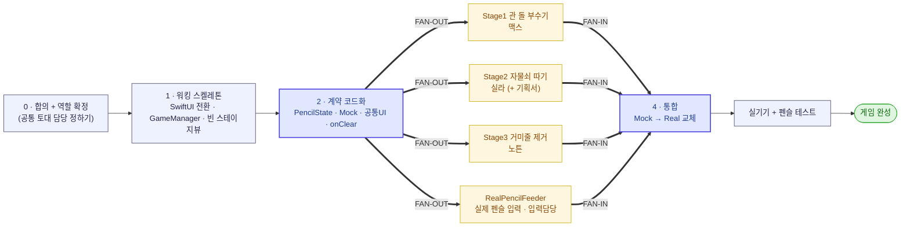

# 협업 방식 (업무 분장 · 병렬 개발)

## 1. 분담 = 피처(스테이지) + 공통 토대

피처(수직 슬라이스) 단위로 한 명이 끝까지 책임지는 건 업계 정석. 단, 스테이지는 완전 독립이 아니므로 **공통 토대 담당**을 따로 둔다.

| 역할 | 담당 영역 |
| --- | --- |
| 공통 토대 | `Core/`, `PencilInput/`(실제 어댑터), `CommonUI/`, `Common/` |
| 스테이지 1 (맥스) | `Stages/Stage1_Rock/` |
| 스테이지 2 (실라) | `Stages/Stage2_Lock/` |
| 스테이지 3 (노튼) | `Stages/Stage3_Spider/` |

> 공통 토대 담당은 별도 1명이 맡거나, 초반 Step 0~1만 셋이 함께 하고 이후 한 명이 유지보수.

## 2. 계약 먼저, 그다음 스텁 (핵심 원칙)

"공통 완성본을 다 만들어 나눠준다"가 **아니다.** 순서는:

1. **계약(인터페이스)부터 합의** — 경계면만 프로토콜/시그니처로. 구현은 비워둬도 됨.
   - 스테이지 → 앱: 클리어/실패 알림 = `onClear`, `onFail`
   - 스테이지 ← 펜슬: `PencilState` (→ `docs/contracts/pencil-input.md`)
   - 전환: `GameManager.advance()`
2. **각자 스텁/목을 끼우고 병렬 개발.**

**용어 (우리 맥락):**
- **스텁(Stub)** = 내가 *호출하는* 의존성의 가짜. 예) 진짜 펜슬 모듈 없이 **슬라이더로 값 흉내(`MockPencilFeeder`)** → "입력은 들어온다 치고" 게임 로직 개발.
- **드라이버(Driver)** = 내 컴포넌트를 *불러주는* 가짜. 예) 입력 담당자가 raw 값을 화면에 찍는 디버그 뷰로 입력만 단독 검증.
- **목(Mock)** = 스텁 + 호출 기록(주로 테스트용).

## 3. 만드는 순서 — 워킹 스켈레톤 먼저

빅뱅 통합(각자 몇 주 따로 만들고 마지막에 합치기)을 피한다. 반대로 간다:

| 단계 | 누가 | 무엇 |
| --- | --- | --- |
| **Step 0** | 다같이 (반나절) | 템플릿 → SwiftUI App 전환 + `GameManager` + `RootView`(분기) + **빈 `Stage1~3View`**(버튼→`onClear`). 스토리→1→2→3→엔딩이 **빈 껍데기로 끝까지 돈다.** |
| **Step 1** | 다같이 | 계약 합의 — `PencilState`, 스테이지 `onClear/onFail`, `GaugeView`/`TimerHUD` 시그니처, `MockPencilFeeder` 스텁 커밋 |
| **Step 2** | 병렬 | 입력 담당: `RealPencilFeeder`+CommonUI / 스테이지 3명: `MockPencilFeeder` 끼고 각자 개발 (서로 안 막힘) |
| **Step 3** | 통합 | 목 → 실제 어댑터 교체, 실기기 테스트. 척추가 있으니 *끼우기만* 하면 됨 |

### 작업 구조 한눈에 — 팬아웃 · 팬인

위 단계를 구조로 보면, **계약(2단계)에서 4갈래로 갈라져(FAN-OUT) 병렬 개발**하고 끝에서 **통합으로 모인다(FAN-IN)**. 단, 워킹 스켈레톤이 통합 슬롯을 미리 만들어두므로 이 팬인은 빅뱅 머지가 아니라 **각자 독립적으로 꽂는 점진 통합**이다.

## 4. 디바이스 의존성 메모

애플펜슬프로 기능(Squeeze·BarrelRoll·Tilt·Pressure)은 **실기기+펜슬에서만** 진짜 테스트된다. 그래서 입력을 `PencilState`로 분리해 **시뮬레이터+목으로 게임 로직 대부분을 개발**하고, 실기기는 입력 어댑터·최종 통합 때만 사용한다.
